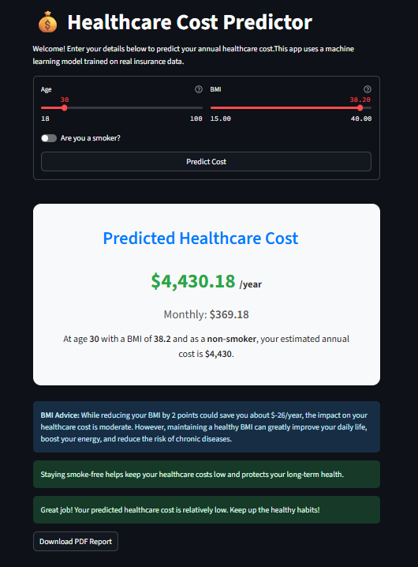

# Healthcare Cost Predictor

This project is a web application that predicts healthcare costs based on user inputs such as age, BMI, and smoking status. The app uses a machine learning model to make these predictions.

## Features
- **Input Fields**: Users can enter their age, BMI, and smoking status.
- **Interaction Input Fields**:it calculates interactional fields which are age_bmi age_smoker and bmi_smoker  
- **Prediction Display**: The app displays the predicted healthcare cost.
- **MinMax Scaling**: The app internally scales the age and BMI inputs for better prediction accuracy.
- **Regression Algorithm**: The app uses a regression algorithm to predict healthcare costs based on the provided.

### App Interface
Here is how the app interface looks:

## Model Training
The predictive model was trained using a dataset from Kaggle. The dataset consists of various features related to healthcare costs.

### Dataset

### Jupyter Notebook
The model was developed and trained using a Jupyter Notebook.

## Usage 
1. Download the project files. 
2. Set up the project requirements. 
3. Run the Flask application. 
4. Open your web browser and go to the provided link. 
5. Enter your age, BMI, and smoking status in the provided fields. 
6. Click on the "Predict Cost" button to see the predicted healthcare cost.

## File Structure
.
├── templates
│   └── index.html
├── .venv
├── app.py
├── Health_insurance_charge_model.sav
├── requirements.txt
└── README.md
